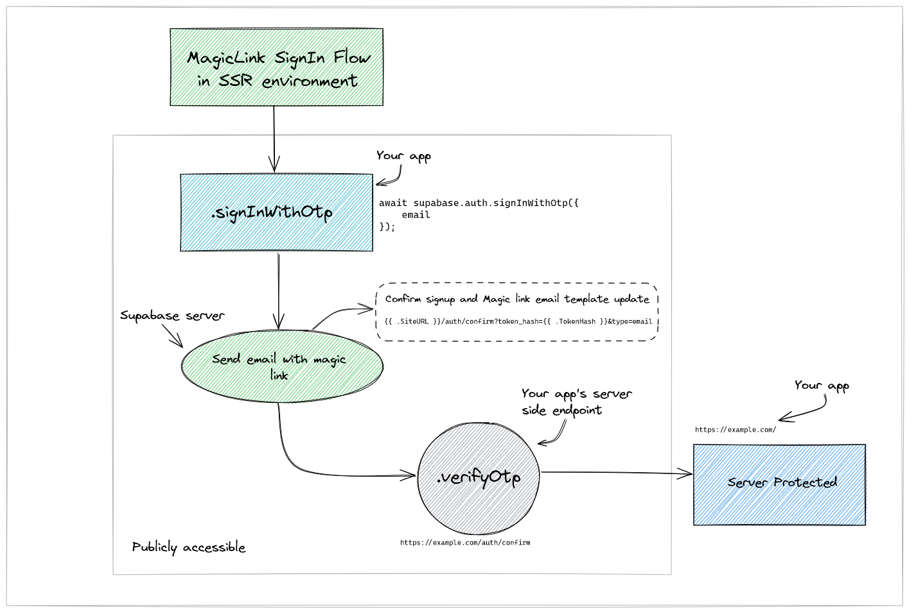
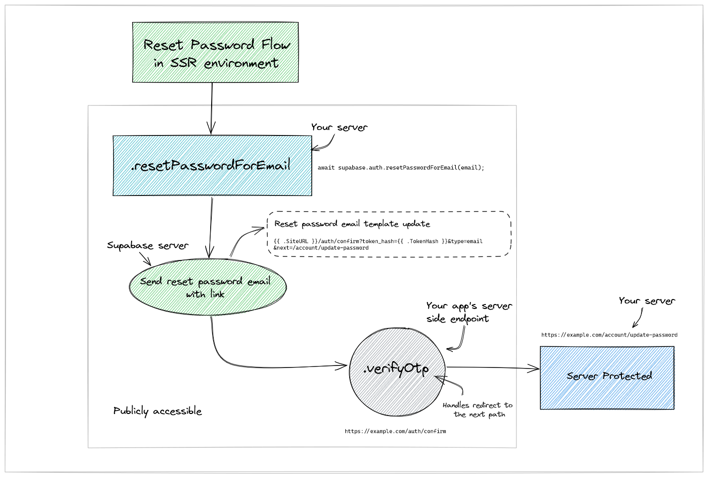
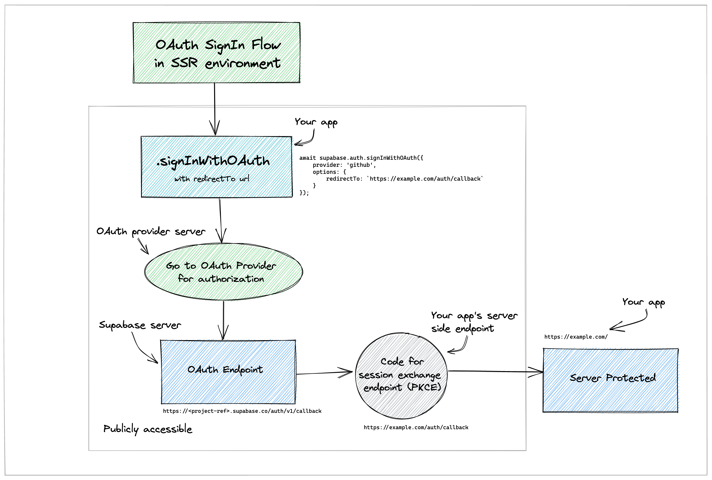

# Supabase by example

These are example projects using supabase in various frameworks. This repo took inspiration from [Solid Templates](https://github.com/solidjs/templates).

## Frameworks

- nextjs
- remix
- sveltekit
- react
- express (only in Magic Link + Otp SignIn and Reset flow example at the moment)

## Getting started

Those templates dependencies are maintained via [pnpm](https://pnpm.io) via `pnpm up -Lri`.

This is the reason you see a `pnpm-lock.yaml`. That being said, any package manager will work. This file can be safely be removed once you clone a template.

These templates are meant to be used as is via the [degit](https://github.com/Rich-Harris/degit) utility.

### Examples

Replace `[framework]` with a framework from the supported list of [frameworks](#Frameworks)

```bash
npx degit silentworks/supabase-by-example/[framework] project-name
cd project-name
npm install # or pnpm install or yarn install
```

## Magic Link Otp SignIn Flow in Server-side rendering (SSR) environment


## Reset Password Flow in Server-side rendering (SSR) environment


## OAuth SignIn Flow in Server-side rendering (SSR) environment

